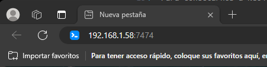
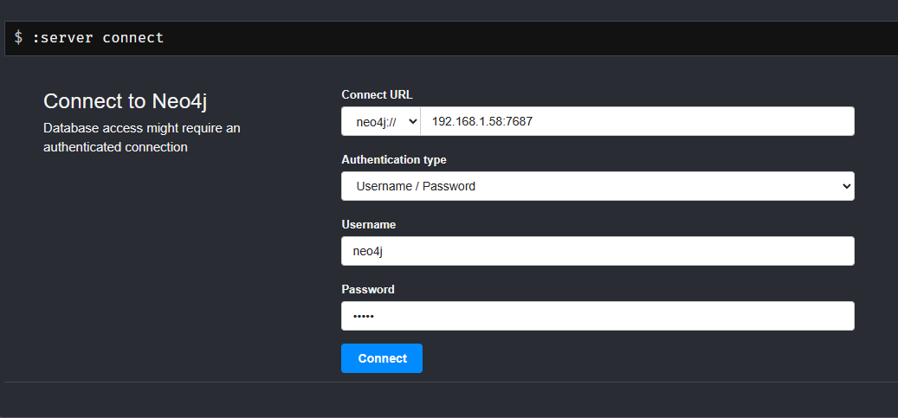
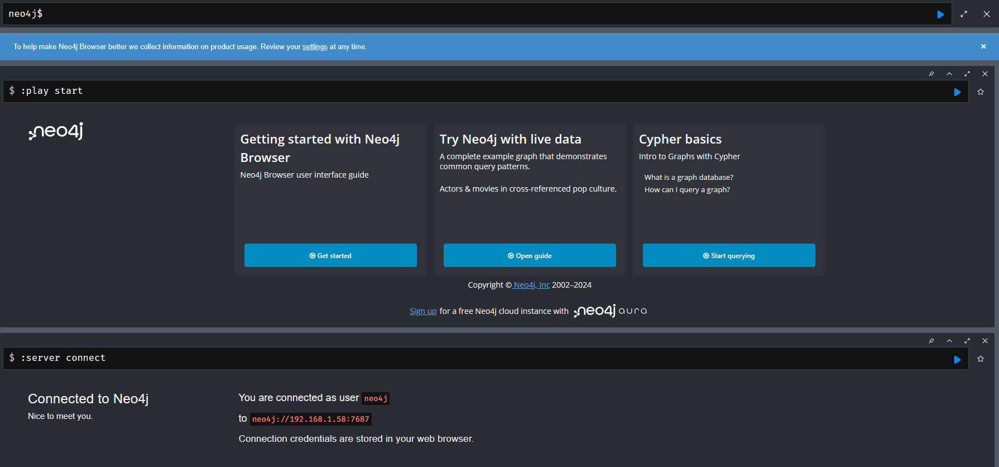
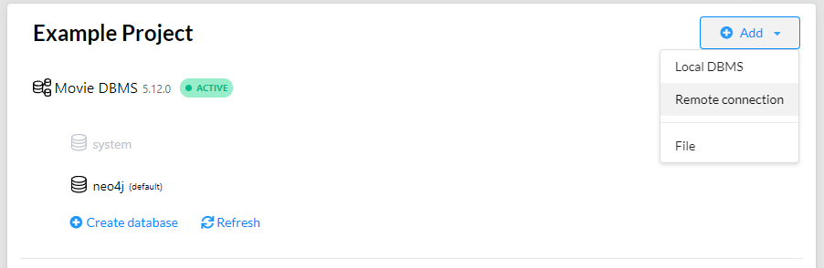
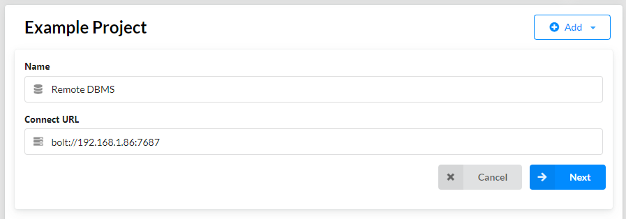
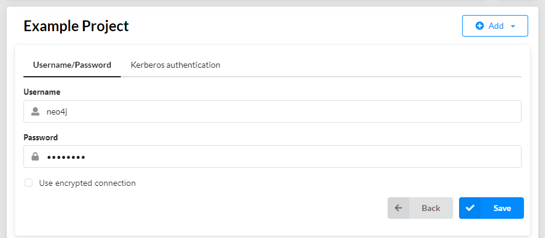
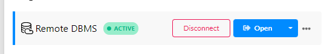
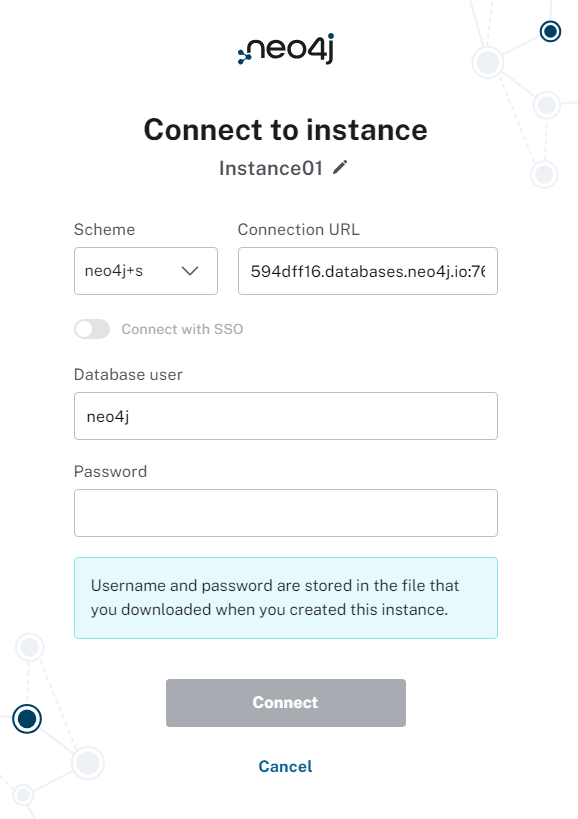

--- 
title: Connexió
layout: default
parent: Manual de l'usuari
nav_order: 5
---

# CONNEXIÓ
Per connectar-te a Neo4j des de la teva aplicació o eina preferida necessitaràs la direcció IP i el port en els que està executant-se el servidor de Neo4j. Per dur a terme aquesta tasca, és necessari haber realitzat la modificació de l'archiu de configuració de Neo4j, el qual ja es va completar durant l'etapa d'instalació. [Modificar arxiu](https://xadouuu7.github.io/A04-NEO4j/Manual%20del%20usuario/instalacion.html#archivo-de-configuracion)

## MENU
- [Connexió mitjançant web](https://xadouuu7.github.io/A04-NEO4j/Manual%20del%20usuario/conexion.html#conexion-mediante-web)
- [Connexió mitjançant Neo4j Desktop](https://xadouuu7.github.io/A04-NEO4j/Manual%20del%20usuario/conexion.html#conexi%C3%B3-mitjan%C3%A7ant-neo4j-desktop)
- [Connexió mitjançant AuraDB](https://xadouuu7.github.io/A04-NEO4j/Manual%20del%20usuario/conexion.html#conexion-mediante-auradb)

## Connexió mitjançant web
Per establir una connexió amb Neo4j a través de HTTP, podem utilitzar simplement el nostre navegador web. Només cal introduir la direcció IP seguida del port a la barra d'adreces del navegador. El port per defecte per a Neo4j és el 7474. Per tant, la URL que inserirem a la barra d'adreces tindria una aparença semblant a això: http://direcció_IP:7474. D'aquesta manera, serem capaços d'accedir a la interfície web de Neo4j i començar a interactuar amb la base de dades.

Després d'introduir la direcció IP i el port a la barra d'adreces del navegador per accedir a Neo4j, se'ns demanarà que proporcionem les credencials de l'usuari i la contrasenya. Aquestes credencials són essencials per autenticar-nos a la base de dades.

Un cop les credencials han estat verificades amb èxit, tindrem accés per treballar amb Neo4j. Això ens permet utilitzar totes les funcionalitats i realitzar operacions sobre la base de dades segons els permisos i privilegis assignats a l'usuari autenticat.

## Conexió mitjançant Neo4j Desktop
### Explicacio
[Neo4j Desktop](https://neo4j.com/download/) es un programa que facilita la gestión y el desarrollo de proyectos basados en Neo4j. Proporciona una interfaz gráfica que permite crear y administrar múltiples bases de datos Neo4j. Además que es esto lo que nos interesa, nos permite conectarnos de manera remota para trabajar con las bases de datos desde cualquier ubicación.

És una aplicació que simplifica la gestió i el desenvolupament de projectes basats en Neo4j. Proporciona una interfície gràfica que facilita la creació i administració de diverses bases de dades Neo4j. A més, permet la connexió remota per treballar amb les bases de dades des de qualsevol ubicació.
### Tutorial
Una vegada tinguis el programa descarregat, simplement caldrà anar a la carpeta de projectes i afegir una connexió remota:

Ara, hem d'afegir el nom del projecte i la URL de la base de dades.

Caldrà afegir les credencials de l'usuari també.

I ja estarem connectats a la nostra base de dades remota.

## Conexion mediante auraDB
### Explicacio
Si volem utilitzar Neo4j a la núvol, podem optar per una solució com AuraDB. Aquesta plataforma ens ofereix la flexibilitat d'allotjar la nostra base de dades Neo4j en un entorn cloud gestionat. El que és interessant és que compta amb un pla gratuït que ens permet provar els seus serveis sense cap cost.
### Tutorial
Per connectar-nos a una instància, simplement caldrà accedir a aquest [link](https://workspace-preview.neo4j.io/connection/connect) i simplement inserir la URL de la nostra connexió amb las credencials del nostre usuari.

