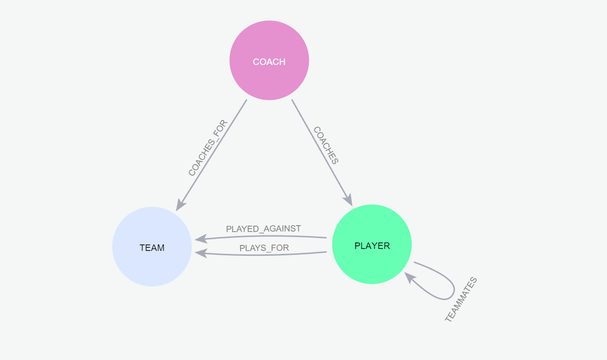
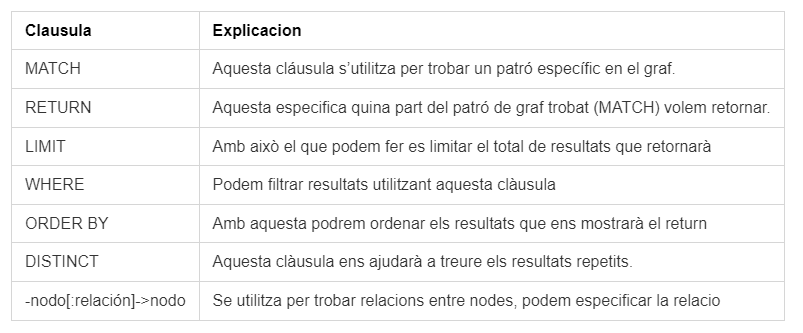
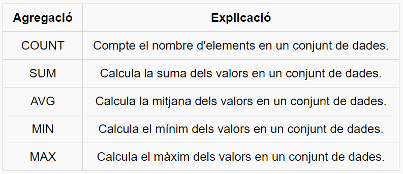

# 1. Consulta de Dades
En aquesta secció, ens adentrarem en les sentències bàsiques de Cypher, el llenguatge utilitzat específicament per interrogar bases de dades de grafs a través de Neo4j. Encara que presenta similituds amb SQL en alguns aspectes, Cypher enhibeix diferències significatives que cal comprendre a fons.

Cypher és un llenguatge declaratiu que proporciona una manera elegant i eficient d'interactuar amb dades emmagatzemades en forma de grafs. A diferència de SQL, que s'enfoca principalment en les relacions entre taules i columnes, Cypher està dissenyat per navegar i consultar estructures de grafs, on els nodes representen entitats i les relacions entre ells són les arestes.

Una de les característiques clau de Cypher és la seva facilitat d'ús i llegibilitat. Les seves sentències es basen en patrons que descriuen les relacions desitjades entre nodes i arestes, utilitzant una sintaxi semblant a un patró visual. Això fa que sigui relativament senzill expressar consultes complexes de manera concisa i comprensible.

# 2. Consultes simples
## 2.1. Creació d'un model de grafs
Primerament, cal crear un model de grafs per poder fer les consultes. Això es pot fer amb la funció ```CREATE```. El següent model serà utilitzat pels exemples que hi ha a continuació: 


```
CREATE
(russell:PLAYER{name:"Russell Westbrook", age: 33, number: 0, height: 1.91, weight: 91}),
(lebron:PLAYER{name:"LeBron James", age: 36, number: 6, height: 2.06, weight: 113}),
(anthony:PLAYER{name:"Anthony Davis", age: 28, number: 23, height: 2.08, weight: 115}),

(frank:COACH{name: "Frank Vogel"}),
(bryan:COACH{name: "bryan Jenkins"}),
(jason:COACH{name: "Jason Kidd"}),

(lakers:TEAM{name:"LA Lakers"}),
(memphis:TEAM{name:"Memphis Grizzlies"}),
(mavericks:TEAM{name:"Dallas Mavericks"}),

(lebron)-[:TEAMMATES]-> (russell),
(lebron)<-[:TEAMMATES]-(russell),

(frank)-[:COACHES]->(lakers),
(bryan)-[:COACHES]->(memphis),

(lebron)-[:PLAYS_FOR {salary: 40000000}]-> (lakers),
(russell)-[:PLAYS_FOR {salary: 33000000}]-> (lakers),

(lebron)-[:PLAYED_AGAINST {minutes: 38, points: 32, assists: 6, rebounds: 6, turnovers: 2}]-> (memphis),
(russell)-[:PLAYED_AGAINST {minutes: 29, points: 16, assists: 12, rebounds: 11, turnovers: 16}]-> (memphis)
```
## 2.2. Sintaxis de Cypher

### 2.2.1. Exemples de consultes bàsiques
{: .important }
>
>  n,r,m és el nom de la variable. Si no es defineix cap valor a una variable en una clàusula   RETURN, aquesta serà NULL.

- Per poder obtenir tots els nodes:
```
MATCH (n) RETURN n
```
- Per obtenir tots els nodes i les seves relacions:
```
MATCH (n)-[r]->(m) RETURN n,r,m
```
- Obtenir només els jugadors:
```
MATCH (n:PLAYER) RETURN n
```
- Per obtenir només els noms dels jugadors (obtindràs una taula, no un gràfic):
```
MATCH (n:PLAYER) RETURN n.name
```
- Per obtenir només X número de jugadors:
```
MATCH (n:PLAYER) RETURN n LIMIT 2
```
- Per obtenir el jugador anomenat 'LeBron James': 
```
MATCH (n:PLAYER {name:'LeBron James'}) RETURN n
```
- Per obtenir només els jugadors que tenen més de 29 anys:
```
MATCH (n:PLAYER) WHERE n.age > 29 RETURN n
```
- Per obtenir només els entrenadors en ordre alfabètic per el seu nom:
```
MATCH (n:COACH)
RETURN n
ORDER BY n.name asc
```
- Per obtenir els entradors dels jugadors:
```
MATCH (n:COACH)-[:COACHES]->(m:PLAYER) RETURN n,m
```
- Per veure els jugadors que cobren més de 35000000 en un equip: 
```
MATCH (player:PLAYER) - [contrato:PLAYS_FOR] -> (team:TEAM)
WHERE contrato.salary >= 35000000
RETURN player,team
```
# 3. Funcions d'agregació

## 3.1. Exemples de consultes amb funcions d'agregació:
- Obtenir el número de jugadors (```COUNT```):
```
MATCH (player:PLAYER)
RETURN COUNT(player) AS numero_de_jugadores;
```
- Per obtenir tots els punts dels partits d'un jugador (```SUM```):
```
MATCH (player:PLAYER {name: "LeBron James"})-[puntos:PLAYED_AGAINST]->(team:TEAM)
RETURN player,SUM(puntos.points)

```
- Obtenir la mitjana d'edat dels jugadors (```AVG```):
```
MATCH (player:PLAYER)
RETURN AVG(player.age)

```
- Per obtenir l'altura mínima dels jugadors (```MIN```):
```
MATCH (player:PLAYER)
RETURN MIN(player.height)
```
- Per obtenir l'altura màxima dels jugadors (```MAX```): 
```
MATCH (player:PLAYER)
RETURN MAX(player.height)
```