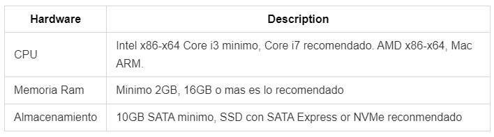
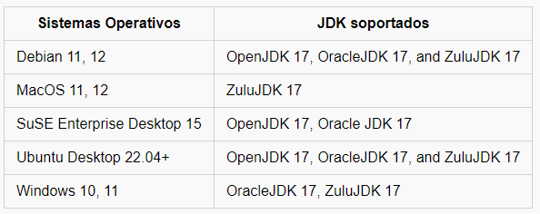
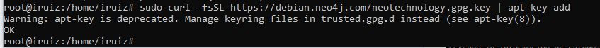
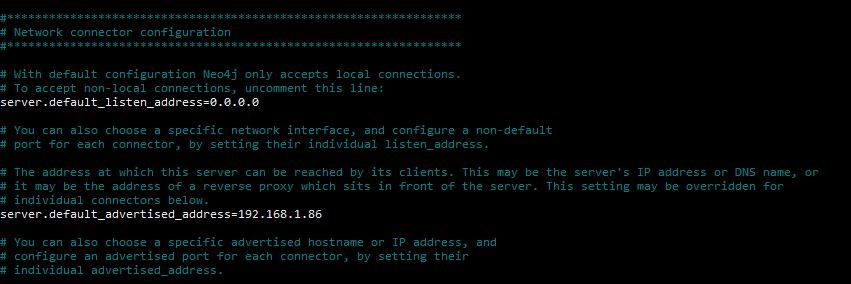
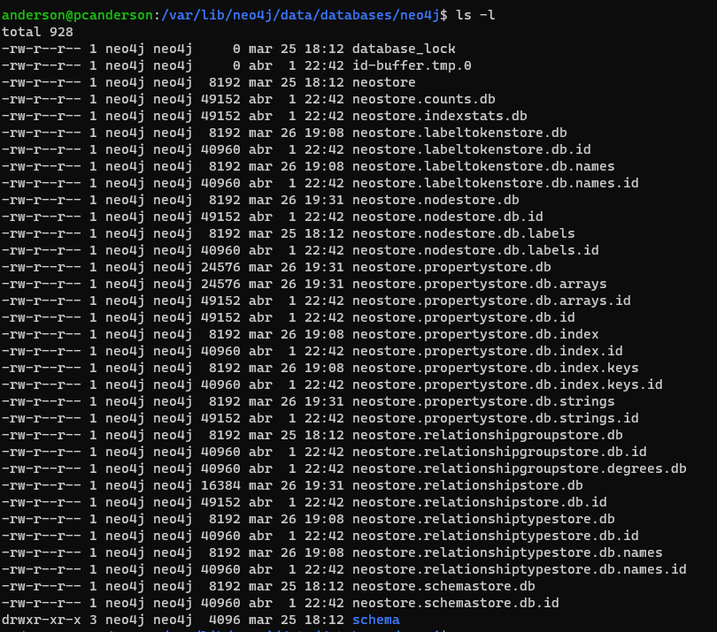

# INSTAL·LACIÓ I CONFIGURACIÓ
## Plataformes suportades
Neo4j suporta arquitectures de sistemes x86_64 i ARM en físic, virtual i/o en contenidors.

## Requisits de hardware


Aquests requisits són per a ús personal o desenvolupament de software.

## Requisits de software
Neo4j suporta diferents sistemes operatius:


# Instal·lació de Neo4j a Debian
Necessitarem una sèrie de paquets per permetre la instal·lació de software de fonts HTTPS:
```
sudo apt install apt-transport-https ca-certificates curl software-properties-common -y
```


Ara utilitzem ```curl``` per descarregar la clau GPG pública de Neo4j per després guardar-la en el magatzem de claus APT:
```
sudo curl -fsSL https://debian.neo4j.com/neotechnology.gpg.key | apt-key add -
```


Afegeix el repositori de Neo4j a la llista de fonts de software, això ens permet cercar i descarregar paquets de Neo4j.
```
sudo add-apt-repository "deb https://debian.neo4j.com/ stable 4.1"
```


Instal·lem Neo4j amb ```apt install```:
```
sudo apt install neo4j
```


Iniciem el servei de Neo4j amb ```systemctl [start|enable|status|] serviceName```:
```
sudo systemctl start neo4j.service
sudo systemctl enable neo4j.service
sudo systemctl status neo4j.service
```


#### arxiu de configuració
Finalment, caldrà que modifiquem el fitxer de configuració de Neo4j amb el nostre editor de text preferit per permetre la connexió a altres hosts. Si fem canvis al fitxer de configuració, haurem de reiniciar el servei amb systemctl restart.

La primera línia descomentada indica la interfície de xarxa predeterminada en què el servidor escoltarà les connexions. En posar 0.0.0.0, ens indica que escoltarà totes les connexions de totes les interfícies de xarxa.

La segona línia indica la direcció que el servidor utilitzarà per anunciar-se a altres dispositius.
```
vim /etc/neo4j/neo4j.conf
server.default_listen_address=0.0.0.0
server.default_advertised_address=192.168.1.86
```


#### arxiu de dades de Neo4j

A Neo4j, les dades habitualment es troben a la ruta /var/lib/neo4j/data/databases, tot i que això pot variar en funció de la configuració específica del sistema. Dins d'aquesta carpeta, trobarem diverses subcarpetes amb el nom de les nostres bases de dades. A l'interior de cadascuna d'aquestes subcarpetes hi ha diversos arxius i altres subcarpetes que contenen la informació rellevant per a cada base de dades. Entre aquests arxius i carpetes, destaquen els següents:

- Els nodes: ```neostore.nodestore.db``` conté les dades relacionades amb els nodes del graf.
- Les relacions: ```neostore.relationshipstore.db``` s'emmagatzemen les relacions que hem creat i definit al graf.
- Propietats clau/valor: ```neostore.propertystore.db``` emmagatzema les propietats clau/valor tant per a nodes com per a relacions.

Aquests són només alguns dels arxius que podem trobar a la carpeta,  que nosaltres creiem que són els més importants
