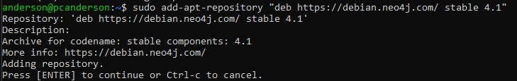
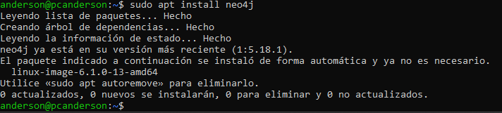

# Instalacion y configuracion
## Plataformas soportadas
neo4j soporta arquitecturas de sistemas x86_64 y ARM en fisico, virtual o y en contenedores
## Requisitos de hardware


Estos requisitos es para uso personal o desarollo de software
## Requisitos de software
Neo4j soporta varios sistemas operativos: 


# Instalacion Neo4j en debian
Necesitaremos una serie de paquetes necesarios para permitir la instalacion de software de fuentes HTTPS

```
sudo apt install apt-transport-https ca-certificates curl software-properties-common -y
```

Ahora utiliza curl para descargar la clave GPG PUBLICA DE Neo4j para despues guardarla en el almacen de claves APT
```
sudo curl -fsSL https://debian.neo4j.com/neotechnology.gpg.key | apt-key add -
```

Agrega el repositorio  de Neo4j a la lista de fuentes de software esto nos permite buscar y descargar paquetes de Neo4j
```
sudo add-apt-repository "deb https://debian.neo4j.com/ stable 4.1"
```


Instala Neo4j con apt install
```
sudo apt install neo4j
```

Inicializamos el Neo4j con systemctl
```
sudo systemctl start neo4j.service
sudo systemctl enable neo4j.service
sudo systemctl status neo4j.service
```


#### ARCHIVO DE CONFIGURACION
Finalment, caldrà que modifiquem el fitxer de configuració de Neo4j amb el nostre editor de text preferit per permetre la connexió a altres hosts. Si fem canvis al fitxer de configuració, haurem de reiniciar el servei amb systemctl restart.

La primera línia descomentada indica la interfície de xarxa predeterminada en què el servidor escoltarà les connexions. En posar 0.0.0.0, ens indica que escoltarà totes les connexions de totes les interfícies de xarxa.

La segona línia indica la direcció que el servidor utilitzarà per anunciar-se a altres dispositius.
```
vim /etc/neo4j/neo4j.conf
server.default_listen_address=0.0.0.0
server.default_advertised_address=192.168.1.86
```


