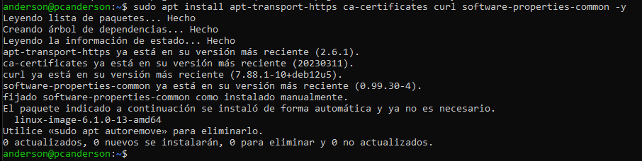
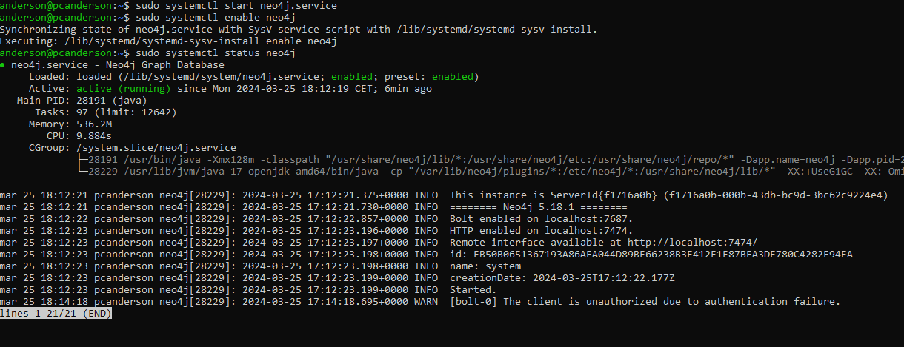

# MANUAL DEL USUARIO
## Plataformas soportadas
neo4j soporta arquitecturas de sistemas x86_64 y ARM en fisico, virtual o y en contenedores
## Requisitos de hardware


Estos requisitos es para uso personal o desarollo de software
## Requisitos de software
Neo4j soporta varios sistemas operativos: 


# Instalacion Neo4j en debian
Necesitaremos una serie de paquetes necesarios para permitir la instalacion de software de fuentes HTTPS

```
sudo apt install apt-transport-https ca-certificates curl software-properties-common -y
```

Ahora utiliza curl para descargar la clave GPG PUBLICA DE Neo4j para despues guardarla en el almacen de claves APT
```
sudo curl -fsSL https://debian.neo4j.com/neotechnology.gpg.key | apt-key add -
```

Agrega el repositorio  de Neo4j a la lista de fuentes de software esto nos permite buscar y descargar paquetes de Neo4j
```
sudo add-apt-repository "deb https://debian.neo4j.com/ stable 4.1"
```


Instala Neo4j con apt install
```
sudo apt install neo4j
```

Inicializamos el Neo4j con systemctl
```
sudo systemctl start neo4j.service
sudo systemctl enable neo4j.service
sudo systemctl status neo4j.service
```


Finalmente tendremos que cambiar el archivo de configuracion de neo4j con nuestro editor de texto preferido para permitir la conexion a otros hosts, si llegamos a cambiar el archivo tendremo que hacer un systemctl restart

```
vim /etc/neo4j/neo4j.conf
```


