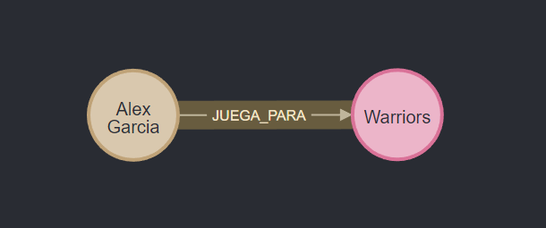

# Manipulació de dades

## SET
Per manipular les dades s'utilitza la clàusula ```SET```, s'utilitza per actualitzar etiquetes en nodes i propietats en nodes i relacions.

Els exemples que donarem utilitzen aquest graf:

```
CREATE (alex:PLAYER{name:"Alex Garcia", age: 28, number: 5, height: 1.99, weight: 95})-[:JUEGA_PARA {salario: 20000000}]->(warriors:TEAM{name: "Warriors"})
```
### Establir propietats
- Per poder canviar l'edat de l'Alex García a 29 i l'altura:
```
MATCH(n:PLAYER {name:"Alex Garcia"})
SET n.age = 29, n.height = 1.99
RETURN n.name, n.age
```
- Per poder canviar el salari que guanya l'Alex García jugant al seu equip:
```
MATCH(n:PLAYER {name:"Alex Garcia"}) -[r:JUEGA_PARA]-> (m:TEAM {name: "Warriors"})
SET r.salario = 1273189031
RETURN n.name, r.salario, m.name
```
### Actualitzar una propietat
- Si volem que el tipus de variable d'edat sigui string en lloc d'enter:
```
MATCH(n:PLAYER {name:"Alex Garcia"})
SET n.age = ToString(n.age)
RETURN n.name, n.age
```
## Eliminar
- Per eliminar un node només:
```
MATCH(n:PLAYER {name:"Alex Garcia"})
DELETE n
```
- Per eliminar només les relacions:
```
MATCH(n:PLAYER {name:"Alex Garcia"}) -[r:JUEGA_PARA]-> (m:TEAM {name: "Warriors"})
DELETE r
```
- Per eliminar un node i totes les seves relacions:
```
MATCH(n:PLAYER {name:"Alex Garcia"})
DETACH DELETE n
```
- Per eliminar tots els nodes i les relacions:
```
MATCH (n) DETACH DELETE n
```

## Remove
La clàusula ```REMOVE``` s'utilitza per treure propietats als nodes i a les relacions.

### Eliminar una propietat
Neo4j no permet emmagatzemar ```null``` en propietats, si no existeix cap valor, la propietat no estarà present. Per tant, una clàusula ```REMOVE``` s'utilitza per eliminar un valor d'una propietat.

Es pot eliminar un o varies etiquetes a la vegada:
```
MATCH(n:PLAYER {name:"Alex Garcia"})
REMOVE n.age, n.height
RETURN n.name, n.age
```