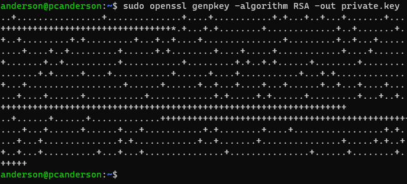
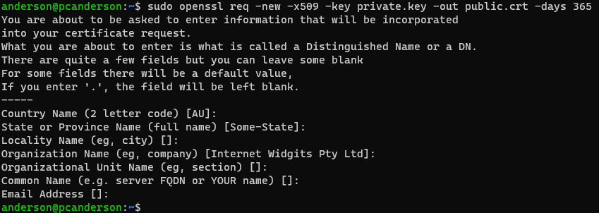
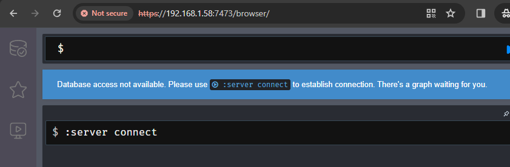

# SEGURIDAD
## Ports predeterminats
Modificar els ports per defecte és una mesura de seguretat útil per mitigar els atacs dirigits als ports coneguts. Per exemple, a Neo4j, que per defecte escolta en dos ports, el 7474 per a HTTP i el 7687 per a Bolt, pots canviar-los entrant al fitxer de configuració /etc/neo4j/neo4j.conf i buscant les seccions de configuració de ports. Simplement descomenta la línia corresponent i canvia el port segons les teves necessitats.


## SSL/TLS
Per crear un fitxer SSL per al nostre Neo4j, necessitarem OpenSSL un programa utilitzat per a la gestió de certificats SSL/TLS, amb aquest podrem generar claus privades. Si no teniu el programa amb un simple ```apt install openssl```. Els fitxers s'hauran de desar a ```/var/lib/neo4j/certificates```

### 1. Generar clave privada
Ara haurem de generar la clau privada, podem fer-ho amb la següent ordre:
```
openssl genpkey -algorithm RSA -out private.key
```
Aquesta ordre generà una clau privada RSA i la desa com a 'private.key'.

### 2. Generar un certificado autofirmado
Amb la següent ordre pots generar un certificat autofirmat utilitzant la clau privada acabada de crear:
```
openssl req -new -x509 -key sslNeo4j.key -out public.crt -days 365
```
Aquesta ordre sol·licitarà informació per al certificat, com ara el país, l'adreça de correu electrònic, entre altres, però no cal proporcionar aquesta informació si no ho desitges.

### 3. Configurar Neo4j con SSL

Ara haurem de tornar a l'arxiu de configuració ```/etc/neo4j/neo4j.conf``` i modificar les següents línies:
#### BOLT
Caldrà crear un directori a ```/var/lib/neo4j/certificates``` anomenat ```bolt```i moure els fitxers. Necessitarem modificar les següents línies. Recomano utilitzar la funció de cerca per trobar-les fàcilment:

```
dbms.connector.bolt.enabled=true
dbms.connector.bolt.tls_level=REQUIRED

dbms.ssl.policy.bolt.enabled=true
dbms.ssl.policy.bolt.base_directory=certificates/bolt
#dbms.ssl.policy.bolt.private_key=private.key 	# Opcional si el fitxer té el mateix nom.
#dbms.ssl.policy.bolt.public_certificate=public.crt 	# Opcional si el fitxer té el mateix nom.
```

#### HTTPS
Caldrà crear un directori a ```/var/lib/neo4j/certificates``` anomenat ```bolt``` i moure els fitxers. Necessitarem modificar les següents línies. Recomano utilitzar la funció de cerca per trobar-les fàcilment:
```
dbms.connector.https.enabled=true

dbms.ssl.policy.https.enabled=true
dbms.ssl.policy.https.base_directory=certificates/https
#dbms.ssl.policy.https.private_key=private.key # Opcional si el fitxer té el mateix nom.
#dbms.ssl.policy.https.public_certificate=public.crt # Opcional si el fitxer té el mateix nom.
```
Finalment, un altre pas per reiniciar el servei i guardar els canvis:
```
systemctl restart neo4j.service
```
