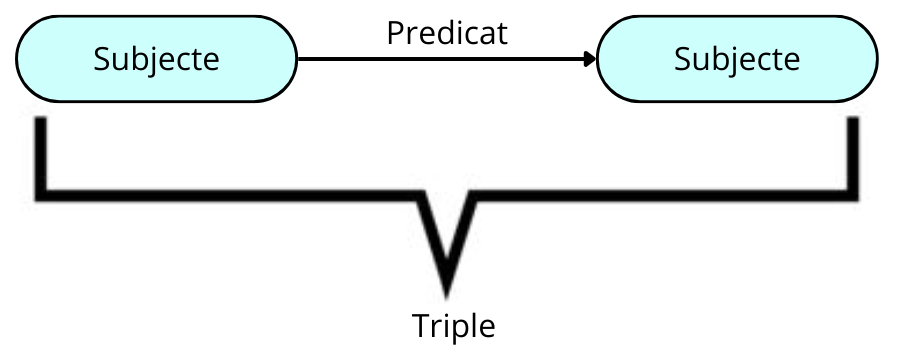

# PART I. Descripció de la base de dades escollida
## Introducció
Neo4j és un software lliure de Base de Dades orientat a grafs implementat en Java. És un magatzem de grafs d’alt rendiment. Descrita pels seus desenvolupadors com una base de dades transaccional compatible amb ACID amb emmagatzematge i processament natiu de grafs. Neo4j està implementat en Java i es accesible des de software escrit en diferents llenguatges utilitzant el llenguatge de consulta Cypher (és el llenguatge declaratiu, inspirat en SQL, que permet consultar, crear, insertar, modificar i eliminar dades en Neo4j).

## Bases de dades orientades a grafs
Aquestes representen la informació com nodes d’un graf i les seves relacions amb les arestes del mateix, de forma que es pugui utilitzar la teoria dels grafs per recórrer la base de dades ja que aquesta pot descriure atributs dels nodes (entitats) i les arestes (relacions). Per poder explicar les Bases de dades orientadas a grafs primer s’ha de conèixer que és un graf. 

## 1. Què és un graf?
La paraula “graf” prové del grec que pot ser traduït com a “imatge” o “dibuix”. Existeixen diferents tipus de grafs que podem utilitzar per a projectes digitals. Les seves característiques permeten moltes possibilitats en anàlisi i solucions de dades a nivell empresarial.  

Un graf és una composició d’un conjunt d’objectes anomenats nodes que es relacionen amb altres nodes a través d’un conjunt de connexions anomenades arestes. Els nodes són els que estan conformats per informació i les arestes que connecten els nodes són els que ens permeten entendre les relacions que existeixen entre els nodes.  Són extremadament útils en situacions complexes, és per això que és comú aconseguir la implementació d’anàlisi de grafs en estudis de ciències exactes, ciències socials i en aplicacions informàtiques (com és aquest cas).
### 1.2. Tipus de grafs
#### 1.2.1. Graf dirigit
Un graf dirigit conegut consta d’un conjunt de vèrtexs i arestes on cada aresta s’associa de forma unidireccional a través d’una fletxa amb un altre. Les arestes, segons la seva sortida o entrada, reben el nom de “entrant” o “sortint”, la condició comú és que sempre tenen un destí dirigit cap a un node.
#### 1.2.2. Graf no dirigit
Els grafs no dirigits són aquells que consten d’un conjunt de vèrtexs que estan connectats a un conjunt d’arestes de forma no direccional. Això significa que una aresta pot indistintament recorre des de qualsevol dels seus punts i en qualsevol direcció.

### 1.3. Propietats principals dels grafs
Com ja hem pogut observar els grafs són un món per si mateix. Contenen un conjunt de característiques i dinàmiques operatives.

Entre les principals propietats que posseeix un graf està la **adjacència** que es tracta de la relació que existeix entre dues arestes que comparteixen la connexió o relació amb un vèrtex comú. Una altra característica és la **incidencia** es tracta simplement de quan un vèrtex està connectat a un altre. 

També hem d'entendre les propietats de la **ponderació** dels grafs que corresponen a una funció en la que cada aresta és classificada, quantificada en diversos termes per augmentar l’expressivitat del model, és una característica molt útil en estudis d’optimització.

Per últim està la propietat de l’**etiquetat**. Aquest tracta de la distinció que es realitza en els vèrtexs mitjançant una marca que els fa distingible dels altres. 

## 2. Bases de dades orientades a grafs

### 2.1. Què és?
Una base de dades orientada a grafs és una plataforma especialitzada i d’un sol propòsit per crear i manipular grafs. Els grafs contenen nodes, vores i propietats que s’utilitzen per representar i emmagatzemar dades d’una forma que no permeten les bases de dades relacionals.

L’analítica de grafs és altre terme d’ús comú i fa referència específicament al procés d’analitzar dades en un format de graf utilitzant els punts de dades com nodes i les relacions com vores. Per la analítica de grafs es precisa una base de dades que admet format de grafs; per exemple, una base de dades orientada a grafs especialitzada o una base de dades convergents que admet diferents models de dades, incluïts els grafs.

### 2.2. Tipus de bases de dades orientades a grafs

Hi ha dos models comuns de bases de dades orientades a grafs: **grafs de propietats** i **grafs RDF**. Els grafs de propietats es centren en l’anàlisi i les consultes, i els RDF es centren en la integració de dades. Ambdós tipus de grafs consisteixen en un conjunt de punts (vèrtexs) i de les connexions entre aquest dos punts (vores) però tenen diferències.

#### 2.2.1. Grafs de propietats

Els grafs de propietats s’utilitzen per modelar les relacions entre les dades i permeten fer anàlisi i consultes sobre les dades en funció d’aquestes relacions. Un graf de propietats té vèrtexs que poden contenir informació detallada sobre un tema, així com vores per resaltar la relació entre aquests vèrtexs. Els vèrtexs i les vores poden tenir atributs (anomenats propietats) als que estan associats.

#### 2.2.2. Grafs RDF

Els grafs **RDF** (Resource Description Framework) compleixen amb un conjunt d'estàndards W3C (Worlwide Web Consortium) dissenyats per representar declaracions; són la millor opció a l’hora de representar metadades complexes i dades principals. Solen utilitzar-se per dades vinculades, integració de dades i grafs de coneixement. 

En el model RDF, una sentència està representada per quatre elements: una vora que es anomenada “triple”, el node font que s’anomena “subjecte”, la vora que connecta ambdós nodes que s’anomena “predicat” i el node al que apunta que s’anomena “objecte”. És de tenir en compte que en un graf un node pot estar en la posició del subjecte en un triple i en la posició d’objecte en un altre triple.

El model RDF aporta un mètode per publicar dades en un format estàndard i amb una semàntica ben definida, el que facilita l’intercanvi d’informació. Les entitats estatals d’estadístiques, les empreses farmacèutiques i les organitzacions sanitàries utilitzen els grafs RDF de manera generalitzada.

## Història

### 1. Historia bases de dades de grafs

La base de dades de grafs s’ha considerat tradicionalment un subtipus de base de dades NoSQL (a diferència de la base de dades centrada en SQL, també coneguda com a base de dades relacional, que ha estat el tipus de base de dades dominant des de finals de la década de 1980 i encara és molt popular entre els entorns informàtics empresarials, grans o petits).

El seu concepte bàsic es basa en la teoria de grafs, més coneguda pel problema dels set ponts de Königsberg que va publicar el matemàtic de renom mundial Leonhard Euler el 1735-1736. Per descomptat, les bases de dades de grafs no van començar a prendre les seves formes fins als últims 10 anys i gairebé 40 anys després de la invenció d’Internet, sense oblidar l’aparició de l’ordinador en sentit modern.

Les bases de dades de grafs han evolucionat al llarg de diverses dècades, amb els primers models de bases de dades que admeten estructures semblants a un arbre a mitjans dels anys seixanta. A finals de la dècada de 1960, es van desenvolupar bases de dades de grafs, i el model de dades lògics va introduir grafs etiquetats a mitjans dels anys vuitanta.

A principis de la dècada de 1990, van sorgir les bases de dades d’objectes comercials (ODBMS) i les millores a les bases de dades de grafs van continuar fins a finals de la dècada de 1990 amb la indexació de pàgines web. Hi havia diverses propostes per a l’estàndard de dades web del W3C com XML i RDF, i aquests formats de dades són en realitat un model de dades de grafs a la seva base. El Object Data Management Group va publicar un llenguatge estàndard per definir estructures d’objectes i relacions l’any 2000. En aquest mateix any es va fundar Neo technologies i va començar a desenvolupar la seva base de dades de grafs: Neo4j. I també van fer el llenguatge de consulta declarativa per al model de grafs, Cypher. Aquest llenguatge pren en préstec alguns conceptes com la concordança de patró de gràfics de SPARQL.

Les bases de dades de grafs comercials amb garanties d’ACID, com ara Neo4j i Oracle Spatial and Graph, van estar disponibles a mitjans i finals dels anys 2000. A la dècada de 2010 es van disposar bases de dades d’escalabilitat horitzontal i multimodel que admetien models de grafs, juntament amb bases de dades de grafs basades en el núvol com Amazon Neptune i Neo4j AuraDB.

Les bases de dades de grafs han crescut en popularitat en els últims anys a causa de la necessitat de gestionar i consultar de manera eficaç les relacions de dades complicades. Representar relacions complexes entre dades a les bases de dades tradicionals pot ser un repte a causa de com gestionen i emmagatzemen les dades.

Contràriament, les bases de dades de grafs representen les dades com una xarxa de nodes i vores, la qual cosa facilita la modelització de relacions intricades entre dades.
S’han inventat molts algorismes de gràfics, des del famós algorisme de Dijkstra (1956 - problema del camí més curt al graf) fins al PageRank que va inventar el cofundador de Google a finals dels anys noranta i a la modularitat de Louvain (detecció de comunitats en un gràfic).

### 2. NEO4J

La primera versió de Neo4j va ser llançada el febrer de 2010 per Neo Technology a San Francisco. Es tracta d’un projecte en curs amb l’última versió estable 3.0 l’abril de 2016. La idea darrere de desenvolupar Neo4j com a programari de processament de grafs era emmagatzemar les relacions com a entitats de primera classe a diferència de les bases de dades agregades NoSQL.
Neo4j es va crear per primera vegada com una base de dades Java incrustada; d’aquí ve el “4j” del nom. Des d’aleshores ha evolucionat més enllà d’això, de manera que l’aspecte de Java ja no és realment rellevant avui en dia, però és un cop d’ull a la seva història.

Neo4j es va crear per abordar alguns problemes que tenien els fundadors en la construcció d’un sistema de gestió de continguts (CMS), específicament per a alguns dels drets i metadades al voltant de l’ús de les fotografies. Els va resultar molt difícil representar en una base de dades relacional a causa de totes les connexions i relacions diferents i la riquesa de les dades. Per això, Neo4j es va crear per primera vegada.

Els fundadors es van adonar ràpidament que hi havia molts altres casos d’ús interessants més enllà d’aquesta base de dades incrustada a l’aplicació CMS. Així, Neo4j va evolucionar ràpidament cap a un sistema més generalitzat. Hi va haver una ràpida adopció de Neo4j, on s’utilitzava per generar recomanacions personalitzades, així com per gestionar la logística i l’encaminament. També va ser popular per fer front als patrons d’accés complexos: inherents a coses com la gestió d’identitats i accés i la detecció de fraus (on interessa les connexions entre els actors) i una xarxa de pagament.

Aquests són alguns dels primers casos d’ús bàsics on Neo4j realment va començar a brillar. Ser capaç d’entendre les connexions de les dades i per què aquestes connexions són importants per als usuaris.

### Casos d’utilització
En cert sentit, moltes de les millors empreses d’Internet actuals es basen en tecnologies de grafs, per citar-ne algunes:
 
- **Google**:PageRank és un algorisme de classificació de pàgines web a gran escala. 

- **Facebook**:La característica bàsica de Facebook és el seu gràfic social: tot es basa en “amics d’amics d’amics” i si algun cop has llegit sobre la Teoria dels Sis nivells de Separació, Facebook construeix a gran xarxa d’amics i perque dues persones es connectin mutuament normalment el salt que hi ha no és més que 5 o 6 amics entre medias **(mirar a ver como coño digo esto bien).**  

- **Twitter**:Els grafs són l’eix vertebrador de Twitter a l’hora d’ensenyar-te els tuits que vols veure segons els “m’agrada” que has fet.

- **LinkedIn**:Una de les característiques socials bàsiques que ofereix és recomanar un professional que estigui a 2 o 3 salts de distància de la persona, i això només és possible mitjançant un motor de gràfics.

- **Goldman Sachs**:Si recordeu l’última crisi financera mundial del 2007-2008 amb la caiguda de Lehman Brothers. El principal líder, Goldman Sachs, va retirar els acords amb Lehman Brothers i el motiu de la retirada va ser que Goldman utilitza un potent sistema Graph DB: SecDB, que va poder calcular i predir l’esclat imminent de la bombolla.

- **PayPal, eBay… comerç electrònic**:La informàtica de grafs no és estranya per aquestes empreses d’Internet de la novaera impulsada per la tecnologia: la competència bàsica dels grafs és que ajuda arevelar correlacions o connectivitats que no són possibles o massa lentes amb lesrelacions relacionals habituals.

## Versions
## Comparacions
#### 6.1. Avantatges
Les bases de dades orientades a grafs tenen diversos avantatges respecte a les bases de dades convencionals:
- **Flexibilitat**: Les bases de dades de grafs es poden adaptar fàcilment a nous models de dades i esquemes a causa del seu alt nivell de flexibilitat. Com a resultat, afegir o canviar dades és senzill i mai requereix fer ajustos importants a l’esquema de la base de dades, que sovint això és un inconvenient a les bases de dades relacionals.

- **Rendiment**: Les bases de dades de grafs són ideals per realitzar consultes complexes en grans conjunts de dades perquè estan dissenyades per travessar de manera eficient les relacions entre nodes i vores. Aquesta és una operació habitual en moltes aplicacions i les bases de dades de grafs estan optimitzades per això.

- **Escalabilitat**: Les bases de dades de grafs sovint poden escalar horitzontalment, el que significa que es poden afegir més nodes al clúster per augmentar l’emmagatzematge i la potència de processament. Això pot simplificar la gestió de grans quantitats de dades i nombroses consultes concurrents. En altres casos, els grafs es poden emmagatzemar en una clau on es poden escalar afegint rèpliques.

- **Processament del llenguatge natural**: Les bases de dades de grafs són molt adequades per a la ciència de dades i l’aprenentatge automàtic combinat amb aplicacions de processament del llenguatge natural (NLP) com ara chatbots, assistents virtuals i anàlisi de sentiments. Es poden utilitzar fàcilment per modelar relacions entre paraules i frases.

- ,**Integració de dades**:Les bases de dades de grafs es poden utilitzar per combinar dades estructurades i no estructurades de diverses fonts. Això pot fer que extreure conclusions de diverses fonts de dades sigui més senzill.

#### 6.2. Desavantatges
- **Estandardització**: Actualment les bases de dades de grafs no tenen un llenguatge de consulta estàndard, però hi ha diversos llenguatges de modelització de dades de grafs estàndards del sector, com ara RDF (Resource Description Framework), OWL (Web Ontology Language), així com Cipher. A més, hi ha diverses iniciatives en marxa per crear llenguatges de consulta estàndard per a bases de dades de grafs com ara GQL (Graph Query Language) i SPARQL (SPARQL Protocol i RDF Query Language). A causa d’això, canviar entre diferents bases de dades de grafs o integrar bases de dades de grafs amb altres tecnologies pot ser un repte a causa de la manca d’estandardització en les consultes. Cada proveïdor de bases de dades de grafs normalment té el seu propi llenguatge de consulta i sintaxi, cosa que dificulta la migració de dades o la integració amb altres sistemes.
- **Comunitats limitades de desenvolupadors i usuaris**: Les bases de dades de grafs tenen una comunitat de desenvolupadors i usuaris més petites que les tecnologies de bases de dades més ben establertes com les bases de dades relacionals. Com a resultat, trobar recursos, informació i suport quan es treballa amb bases de dades de grafs pot ser més difícil. No obstant això, la comunitat al voltant de les bases de dades de grafs està creixent ràpidament.
- **Coherència de dades**: Les bases de dades de grafs estan dissenyades per permetre relacions més flexibles i dinàmiques entre les dades, cosa que pot fer que sigui més difícil aplicar regles estrictes de coherència de dades. Tanmateix, val la pena assenyalar que moltes bases de dades de grafs ofereixen mecanismes per garantir la coherència de les dades, com ara mitjançant l’ús de restriccions o regles de validació. A més, la coherència de les dades també es pot aplicar a nivell d’aplicació, en lloc de dependre només de la tecnologia de la base de dades.

[^1]: [It can take up to 10 minutes for changes to your site to publish after you push the changes to GitHub](https://docs.github.com/en/pages/setting-up-a-github-pages-site-with-jekyll/creating-a-github-pages-site-with-jekyll#creating-your-site).

[Just the Docs]: https://just-the-docs.github.io/just-the-docs/
[GitHub Pages]: https://docs.github.com/en/pages
[README]: https://github.com/just-the-docs/just-the-docs-template/blob/main/README.md
[Jekyll]: https://jekyllrb.com
[GitHub Pages / Actions workflow]: https://github.blog/changelog/2022-07-27-github-pages-custom-github-actions-workflows-beta/
[use this template]: https://github.com/just-the-docs/just-the-docs-template/generate
