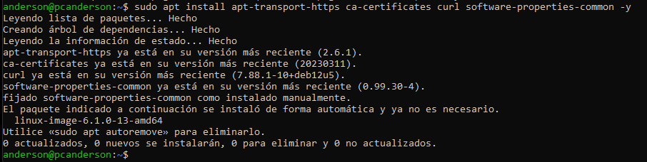
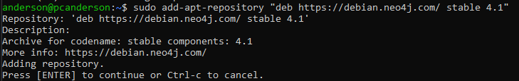
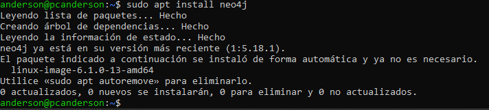
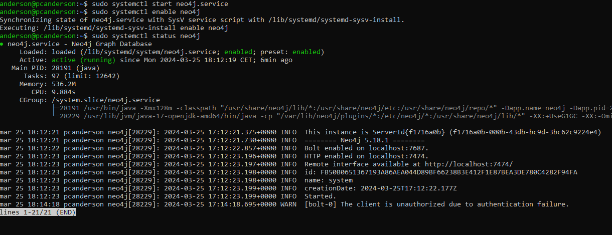

# MANUAL DEL USUARIO
## Plataformas soportadas
neo4j soporta arquitecturas de sistemas x86_64 y ARM en fisico, virtual o y en contenedores
## Requisitos de hardware
| Hardware       | Description                                                              |
|----------------|--------------------------------------------------------------------------|
| CPU            | Intel x86-x64 Core i3 minimo, Core i7 recomendado. AMD x86-x64, Mac ARM. |
| Memoria Ram    | Minimo 2GB, 16GB o mas es lo recomendado                                 |
| Almacenamiento | 10GB SATA minimo, SSD con SATA Express or NVMe reconmendado              |

Estos requisitos es para uso peronal o desarollo de software
## Requisitos de software
Neo4j soporta varios sistemas operativos: 


Windows 10, 11
# Instalacion Neo4j en debian
Necesitaremos una serie de paquetes necesarios para permitir la instalacion de software de fuentes HTTPS

```
sudo apt install apt-transport-https ca-certificates curl software-properties-common -y
```

Ahora utiliza curl para descargar la clave GPG PUBLICA DE Neo4j para despues guardarla en el almacen de claves APT
```
sudo curl -fsSL https://debian.neo4j.com/neotechnology.gpg.key | apt-key add -
```

Agrega el repositorio  de Neo4j a la lista de fuentes de software esto nos permite buscar y descargar paquetes de Neo4j
```
sudo add-apt-repository "deb https://debian.neo4j.com/ stable 4.1"
```


Instala Neo4j con apt install
```
sudo apt install neo4j
```

Inicializamos el Neo4j con systemctl
```
sudo systemctl start neo4j.service
sudo systemctl enable neo4j.service
sudo systemctl status neo4j.service
```



https://debian.neo4j.com/